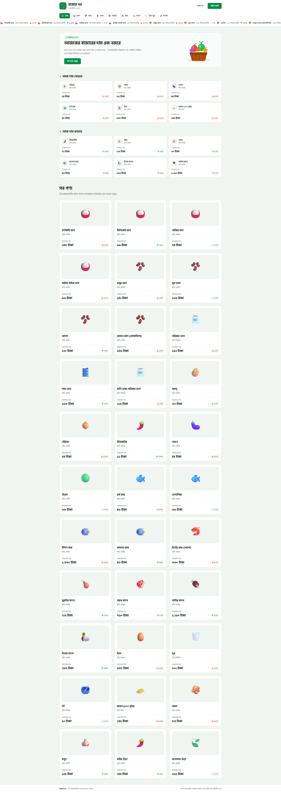
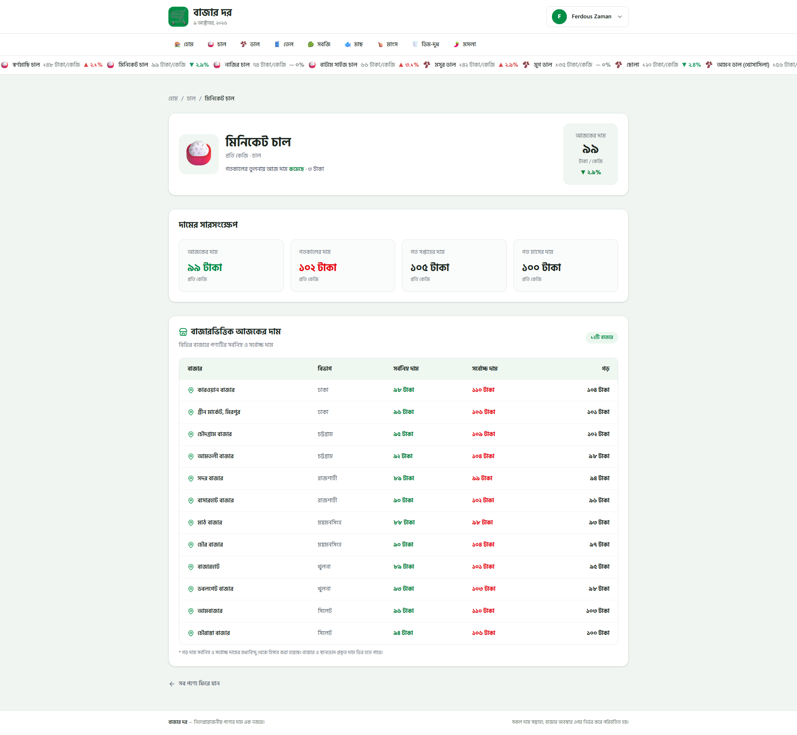
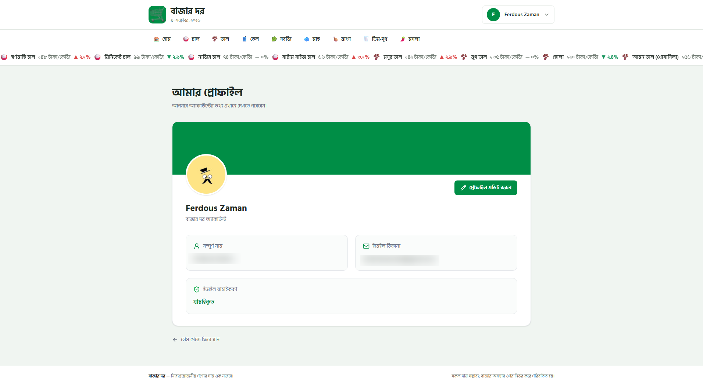
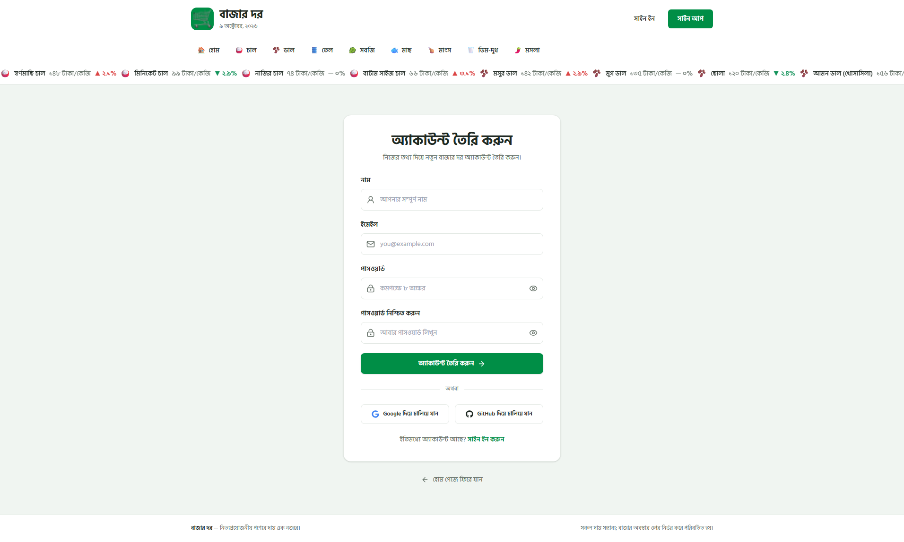

# BAZARDOR (বাজার দর)

### Know the price. Shop smarter.

BazarDor is a modern, responsive essential goods price-tracking application built with **Next.js**. Users can explore the latest market prices of everyday products in Bangladesh, compare price changes, browse products by category, and view detailed market-wise price information.

The application also supports secure user authentication with **BetterAuth**, including email/password, Google, and GitHub sign-in, along with personal profile management.

---

## 🔗 Live Demo

**Live Website:** https://bazardor-three.vercel.app/

**GitHub Repository:** https://github.com/FZ-Fahim/PH-Assignment07

---

## 🖼️ Preview

<table>
  <tr>
    <td width="50%" rowspan="3" align="center">
      
      <br>
      <b>Home Page</b>
    </td>
    <td width="50%" align="center">
      
      <br>
      <b>Product Details</b>
    </td>
  </tr>
  <tr>
    <td width="50%" align="center">
      
      <br>
      <b>User Profile</b>
    </td>
  </tr>
  <tr>
    <td width="50%" align="center">
      
      <br>
      <b>Sign Up</b>
    </td>
  </tr>
</table>

---

## 📖 About the Project

BazarDor is designed to make everyday market price information easy to access, understand, and compare.

The application displays prices for essential goods such as rice, lentils, cooking oil, vegetables, fish, meat, eggs, dairy products, and spices.

Users can quickly identify products with the highest price increases or decreases, explore category-specific products, and review individual product prices across different markets and divisions of Bangladesh.

Product and category information is retrieved from the provided **BazarDor REST API**, with automatic fallback support when the primary API becomes unavailable.

User accounts and authentication data are managed with **BetterAuth** and **MongoDB Atlas**.

---

## ✨ Features

* **Today's Market Prices** — Explore the latest prices of essential goods in a responsive product grid.
* **Live Price Ticker** — View a continuously scrolling ticker featuring product prices and their percentage changes.
* **Top Price Increases** — Discover the six products with the highest price increases.
* **Top Price Decreases** — Discover the six products with the largest price decreases.
* **Category Navigation** — Browse products across eight essential goods categories.
* **Category-Based Sorting** — Sort products by price within individual categories.
* **Product Details** — View current prices, historical price comparisons, and price-change information.
* **Market-Wise Price Comparison** — Explore minimum, maximum, and estimated average prices across different markets.
* **Protected Product Details** — Require authentication to access individual product details.
* **Email and Password Authentication** — Register and sign in securely using BetterAuth.
* **Social Authentication** — Sign in with Google or GitHub.
* **User Profile** — View account details, email, and profile information.
* **Edit Profile** — Update the user's name and profile image using an image URL.
* **Session Management** — Maintain authentication sessions and support secure sign-out.
* **API Fallback Support** — Automatically try an alternative API endpoint when a request fails.
* **Responsive Design** — Optimized for mobile, tablet, and desktop screens.
* **Loading Skeletons** — Display loading placeholders while page content is being fetched.
* **Custom 404 Page** — Show a custom Bengali error page for invalid routes.
* **Error Handling** — Display user-friendly messages and retry options when something goes wrong.
* **Bengali Interface** — Present product information, navigation, and prices in Bangla.

---

## 🛠️ Technologies Used

* **Next.js 16** — App Router and server-side rendering
* **React**
* **TypeScript**
* **Tailwind CSS v4**
* **BetterAuth** — Authentication and session management
* **MongoDB Atlas** — Cloud database
* **MongoDB Node.js Driver**
* **Google OAuth**
* **GitHub OAuth**
* **Lucide React** — Interface icons
* **React Icons** — Social authentication icons
* **React Hot Toast** — Toast notifications
* **REST API** — Market price and category data
* **Vercel** — Hosting and deployment

---

## 🔌 API

BazarDor uses the provided essential goods price API.

### Primary API

```text
https://api.abcz.workers.dev/api/bazardor
```

### Alternative API

```text
https://api.api-store.workers.dev/api/bazardor
```

### API Endpoints

| Endpoint | Description |
|---|---|
| `/products` | Retrieve all products |
| `/products/:id` | Retrieve a product by ID |
| `/products?category=chal` | Retrieve products by category |
| `/categories` | Retrieve all categories |
| `/categories/:slug` | Retrieve category information |

The application automatically tries the alternative API when the primary API fails or becomes rate-limited.

Each product contains its current price, previous prices, percentage change, category, and market-specific price information.

The average shown for each market is calculated as:

**Estimated Average = (Minimum Price + Maximum Price) / 2**

This is the midpoint of the reported price range, not an average calculated from individual sellers' prices.

---

## 🔐 Authentication

BazarDor uses **BetterAuth** with **MongoDB Atlas** for authentication and user management.

Supported authentication methods include:

* Email and password registration
* Email and password sign-in
* Google OAuth
* GitHub OAuth
* Session-based authentication
* Secure sign-out
* Protected routes
* Profile updates

Visitors can browse the homepage and product categories without logging in. However, accessing an individual product details page requires authentication.

After signing in, users are redirected to their originally requested product page.

---

## 📁 Project Structure

```text
src/
├── app/
│   ├── api/
│   │   └── auth/
│   │       └── [...all]/
│   │           └── route.ts
│   │
│   ├── category/
│   │   └── [slug]/
│   │       ├── page.tsx
│   │       └── loading.tsx
│   │
│   ├── product/
│   │   └── [slug]/
│   │       ├── page.tsx
│   │       └── loading.tsx
│   │
│   ├── profile/
│   │   ├── page.tsx
│   │   ├── loading.tsx
│   │   └── edit/
│   │       ├── page.tsx
│   │       └── EditProfileForm.tsx
│   │
│   ├── signin/
│   │   ├── page.tsx
│   │   ├── SignInPage.tsx
│   │   └── SignInForm.tsx
│   │
│   ├── signup/
│   │   └── page.tsx
│   │
│   ├── globals.css
│   ├── layout.tsx
│   ├── page.tsx
│   ├── loading.tsx
│   ├── not-found.tsx
│   └── error.tsx
│
├── components/
│   ├── homepage/
│   │   ├── Banner.tsx
│   │   ├── TopRisers.tsx
│   │   └── TopFallers.tsx
│   │
│   ├── shared/
│   │   ├── Navbar.tsx
│   │   ├── AuthButtons.tsx
│   │   ├── CategoryNav.tsx
│   │   ├── PriceTicker.tsx
│   │   └── Footer.tsx
│   │
│   ├── products/
│   │   ├── ProductCard.tsx
│   │   ├── ProductGrid.tsx
│   │   └── ProductCardSkeleton.tsx
│   │
│   └── ui/
│       └── ToastProvider.tsx
│
├── lib/
│   ├── api/
│   │   ├── config.ts
│   │   └── products.ts
│   ├── utils/
│   │   └── format.ts
│   ├── auth.ts
│   ├── auth-client.ts
│   └── mongodb.ts
│
├── types/
│   └── product.ts
│
└── assets/
    ├── bazar-hero.png
    └── logo-icon.png
```

---

## 🚀 Getting Started

### Clone the Repository

```bash
git clone https://github.com/FZ-Fahim/PH-Assignment07.git
```

### Open the Project

```bash
cd PH-Assignment07
```

### Install Dependencies

```bash
npm install
```

### Configure Environment Variables

Create a `.env.local` file in the root directory:

```env
MONGODB_URI=your_mongodb_atlas_connection_string
MONGODB_DB=bazardor

BETTER_AUTH_SECRET=your_secure_random_secret
BETTER_AUTH_URL=http://localhost:3000

GOOGLE_CLIENT_ID=your_google_client_id
GOOGLE_CLIENT_SECRET=your_google_client_secret

GITHUB_CLIENT_ID=your_github_client_id
GITHUB_CLIENT_SECRET=your_github_client_secret
```

Replace the placeholder values with your own credentials.

For local OAuth configuration, register the following callback URLs with their respective providers:

**Google:**

```text
http://localhost:3000/api/auth/callback/google
```

**GitHub:**

```text
http://localhost:3000/api/auth/callback/github
```

The MongoDB Atlas database must also allow connections from your development environment.

**Never commit `.env.local` or expose your API credentials and authentication secrets.**

### Run the Development Server

```bash
npm run dev
```

Open the application in your browser:

```text
http://localhost:3000
```

---

## 🏗️ Build for Production

Create a production build:

```bash
npm run build
```

Start the production server:

```bash
npm run start
```

The project is deployed on **Vercel** with production environment variables and OAuth callback URLs configured for the live domain.

---

## 🎯 Assignment Objective

The objective of this assignment was to develop a modern, responsive essential goods price-tracking application using **Next.js**, following the provided design and functional requirements.

The project focuses on component-based architecture, REST API integration, dynamic routing, protected pages, price analysis, secure authentication, MongoDB database integration, responsive design, and production deployment.

BazarDor aims to provide an accessible Bengali-language platform where users can understand and compare everyday market prices across Bangladesh.

---

## 👨‍💻 Author

**Ferdous Zaman**

**GitHub:** https://github.com/FZ-Fahim

---

## ⭐ Acknowledgements

* Design and requirements provided as part of the **Programming Hero assignment**.
* Product and category data provided through the **BazarDor API**.
* Built for educational purposes using Next.js, BetterAuth, MongoDB Atlas, and modern web development technologies.